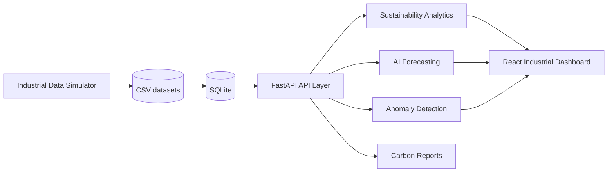
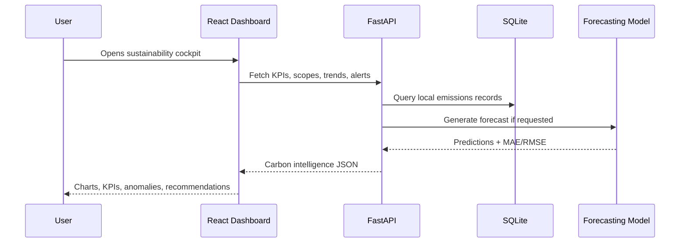

# Carbon Intelligence Platform

A local-only carbon emissions analytics and sustainability intelligence platform for industrial facilities, manufacturing campuses, and power-grid-connected operations. The repository is designed as a portfolio-quality implementation that demonstrates clean architecture, carbon accounting, ESG analytics, AI forecasting, anomaly detection, and modern industrial dashboard engineering.

> This project intentionally avoids deployment infrastructure, cloud hosting, Kubernetes, Docker orchestration, authentication systems, CI/CD pipelines, and enterprise production setup. It focuses on local development and code implementation.

## Features
 
- Full Scope 1, Scope 2, and Scope 3 carbon emissions tracking.
- Synthetic industrial telemetry for factories and energy-intensive manufacturing systems.
- Configurable emission-factor based carbon calculation engine.
- Facility-wise, department-level, and source-level emissions analytics.
- Carbon intensity, renewable contribution, offsets, and net-zero progress KPIs.
- AI-powered forecasting for emissions and energy demand using scikit-learn.
- Train/test splitting, MAE/RMSE evaluation, and local model saving/loading.
- Anomaly detection for emissions spikes, inefficient operations, abnormal energy use, and sustainability regressions.
- FastAPI backend with Pydantic schemas and SQLite local storage.
- React + TypeScript + TailwindCSS frontend with Recharts visualizations.
- ESG scoring and carbon reduction recommendation examples.

## Scope 1 / 2 / 3 Accounting

| Scope | What it represents | Implemented examples |
| --- | --- | --- |
| Scope 1 | Direct emissions from owned or controlled sources | Industrial machinery, fuel combustion, company-owned vehicles, manufacturing processes |
| Scope 2 | Indirect emissions from purchased energy | Purchased electricity, heating/cooling loads, utility energy usage |
| Scope 3 | Other indirect value-chain emissions | Suppliers, transportation/logistics, employee commuting, waste disposal, business travel, product lifecycle impact |

Emission factors are kept in `backend/app/services/emission_factors.py` and are consumed by `CarbonCalculationEngine`.

## Repository Structure

```text
carbon-intelligence-platform/
├── backend/       # FastAPI app, APIs, services, models, simulators, analytics, forecasting
├── frontend/      # React + TypeScript + TailwindCSS enterprise dashboard
├── analytics/     # Standalone ESG scoring and analytics helpers
├── ml/            # Local model artifacts written by training jobs
├── datasets/      # Generated CSV datasets for analytics and ML
├── reports/       # Local report exports and screenshot placeholders
├── scripts/       # Developer scripts such as dataset generation
├── docs/          # Architecture notes
└── README.md
```

## System Architecture





## Synthetic Dataset

The simulator generates `datasets/industrial_emissions.csv` with realistic industrial patterns:

- Daily production cycles and weekday/weekend behavior.
- Seasonal energy variation.
- Peak electricity demand windows.
- Renewable intermittency.
- Equipment inefficiency and maintenance drag.
- Regional grid emission-factor differences.
- Electricity usage, fuel consumption, renewable energy, transportation emissions, industrial process activity, production output, carbon offsets, and waste impact.

Generate or refresh the dataset:

```bash
cd carbon-intelligence-platform
python scripts/generate_datasets.py
```

## Backend Setup

```bash
cd carbon-intelligence-platform/backend
python -m venv .venv
source .venv/bin/activate
pip install -r requirements.txt
uvicorn app.main:app --reload
```

The backend starts at `http://localhost:8000` and initializes SQLite from the generated CSV.

## Frontend Setup

```bash
cd carbon-intelligence-platform/frontend
npm install
npm run dev
```

The frontend starts at `http://localhost:5173` and reads the local API at `http://localhost:8000` by default.

## API Examples

```bash
curl http://localhost:8000/emissions/live
curl http://localhost:8000/emissions/scope1
curl http://localhost:8000/emissions/scope2
curl http://localhost:8000/emissions/scope3
curl http://localhost:8000/analytics/trends
curl http://localhost:8000/analytics/forecast?horizon_days=30
curl http://localhost:8000/alerts
curl http://localhost:8000/reports
curl -X POST http://localhost:8000/model/train
```

## Forecasting Logic

The forecasting module aggregates daily emissions and builds lag-aware features:

- Calendar features: day of week and month.
- Operational features: electricity, renewables, production, fuel, logistics distance.
- Time-series features: lag-1, lag-7, and rolling 7-day emissions.
- Model: `RandomForestRegressor` for resilient nonlinear baseline forecasting.
- Evaluation: chronological train/test split with MAE and RMSE.
- Persistence: local `ml/emissions_forecaster.joblib` artifact.

## Dashboard Screenshots

Place screenshots in `reports/` as the UI evolves:

```text
reports/dashboard-command-center.png
reports/forecasting-panel.png
reports/facility-comparison.png
```

## Sustainability Use Cases

- Manufacturing footprint monitoring across multiple facilities.
- Renewable procurement and load-shifting analysis.
- Industrial process carbon intensity benchmarking.
- Scope 3 supplier and logistics planning.
- Emissions spike root-cause investigations.
- Executive ESG reporting and net-zero roadmap tracking.
- Forecasting peak emissions periods before production ramps.

## Future Improvements

- Add additional forecasting algorithms and model comparison reports.
- Expand PDF report generation with charts and executive summaries.
- Add optimization routines for renewable scheduling and energy storage.
- Include marginal abatement cost modeling.
- Add a local AI sustainability assistant over reports and KPI trends.
- Enrich Scope 3 categories with supplier-specific emission factors.
